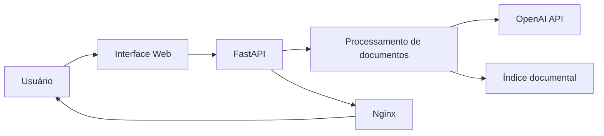

# Assistente de Documentos

> Plataforma inteligente para leitura, organização e consulta de documentos, hospedada na Oracle Cloud Infrastructure e integrada à API da OpenAI.

O **Assistente de Documentos** automatiza etapas repetitivas da análise documental. A aplicação recebe arquivos, extrai seu conteúdo, organiza informações relevantes e disponibiliza uma interface web para consulta dos documentos processados.

## Funcionalidades

- Upload e processamento de documentos.
- Leitura de arquivos PDF e DOCX.
- Extração de conteúdo com inteligência artificial.
- Organização de informações em um índice documental.
- Consulta de documentos já processados.
- Execução em ambiente de nuvem na OCI.

## Arquitetura



## Tecnologias

| Categoria | Tecnologias |
|---|---|
| Backend | Python, FastAPI, Uvicorn |
| IA | OpenAI API |
| Documentos | PyPDF, python-docx |
| Infraestrutura | Oracle Cloud Infrastructure |
| Servidor web | Nginx |
| Versionamento | Git e GitHub |

## Estrutura do projeto

```text
assistente-documentos/
├── main.py
├── documentos.py
├── indice.py
├── config.py
├── README.md
└── .gitignore
```

## Execução local

```bash
python3 -m venv .venv
source .venv/bin/activate
pip install fastapi "uvicorn[standard]" openai pypdf python-docx python-dotenv python-multipart
```

Crie o arquivo `.env.local`:

```text
OPENAI_API_KEY=sua_chave_aqui
```

Inicie a aplicação:

```bash
uvicorn main:app --host 127.0.0.1 --port 8000
```

## Implantação na OCI

A aplicação é executada em uma VM Ubuntu na Oracle Cloud Infrastructure, com Uvicorn como servidor da aplicação e Nginx como proxy reverso na porta HTTP.

## Segurança

Os seguintes itens não são versionados:

- `.env.local`
- `.venv/`
- `uploads/`
- Índices gerados a partir dos documentos
- Arquivos temporários de processamento

## Status

✅ Aplicação publicada na OCI  
✅ Processamento documental com IA  
✅ Versionamento com Git e GitHub  
✅ Proteção de chaves e dados sensíveis  

---

Projeto desenvolvido com Python, Oracle Cloud Infrastructure e OpenAI API.
